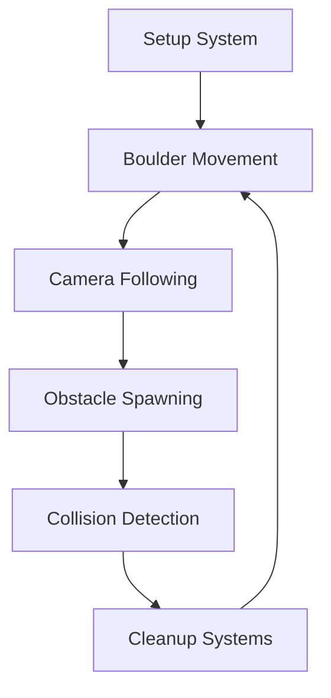

# 🌿 Valley Crusher

> **Unleash ancient fury in the cursed swamplands!**

Command a massive moss-covered boulder as it thunders down through a haunting swamp valley, leaving nothing but destruction in its wake. This isn't just rolling - this is **primal devastation**.

[](https://www.rust-lang.org)
[](https://bevyengine.org)
[](LICENSE)

---

## 🎮 Gameplay

Take control of a **6-foot-wide ancient stone**, scarred by centuries in the murky depths. Thick green moss clings to its weathered surface as you barrel down treacherous swampland slopes, crushing everything in your path.

### 🏚️ **Destructible Obstacles**
- **Rotting Swamp Shacks** - Weathered wood that explodes into splinters
- **Twisted Ancient Trees** - Moss-draped giants with hanging vines  
- **Crumbling Fences** - Decaying barriers that burst like paper
- **Fallen Logs** - Massive tree trunks covered in mushrooms
- **Moss-Covered Rocks** - Nothing stops your relentless descent

### 🌫️ **Atmospheric Features**
- Thick swamp fog with dynamic lighting
- Realistic physics-based boulder movement
- Procedurally generated obstacle layouts
- Immersive 3D audio design
- Weather effects and particle systems

---

## 🎯 Controls

| Input | Action |
|-------|--------|
| `←` `A` | Steer boulder left |
| `→` `D` | Steer boulder right |
| `ESC` | Pause/Menu |

*The boulder maintains forward momentum automatically - focus on dodging or crushing obstacles!*

---

## 🛠️ Technology Stack

Built with modern Rust game development tools:

- **🦀 Rust** - Memory-safe systems programming
- **🎲 Bevy Engine** - Data-driven game engine with ECS architecture  
- **🎨 PBR Rendering** - Physically-based materials and lighting
- **🔊 3D Audio** - Spatial sound with environmental effects
- **⚡ Multi-threaded** - Parallel systems for smooth performance

### Key Features
- **Entity Component System (ECS)** architecture
- **Custom mesh generation** for unique swamp obstacles
- **Advanced materials** with normal mapping and PBR workflow
- **Dynamic fog and atmospheric effects**
- **Procedural content generation**

---

## 🚀 Quick Start

### Prerequisites
- [Rust](https://rustup.rs/) 1.70 or higher
- Git

### Installation

```bash
# Clone the repository
git clone https://github.com/your-username/valley-crusher.git
cd valley-crusher

# Build and run (debug mode)
cargo run

# Build optimized release version
cargo run --release
```

### 📁 Project Structure

```
valley_crusher/
├── 📄 Cargo.toml                 # Project configuration & dependencies
├── 📄 README.md                  # You are here!
├── 📂 src/                       # Source code
│   ├── 📄 main.rs               # Application entry point
│   ├── 📄 components.rs         # ECS component definitions
│   ├── 📄 resources.rs          # Global game resources
│   └── 📂 systems/              # Game logic systems
│       ├── 📄 mod.rs            # System module exports
│       ├── 📄 setup.rs          # World initialization
│       ├── 📄 boulder.rs        # Player boulder physics
│       ├── 📄 camera.rs         # Dynamic camera system
│       ├── 📄 obstacles.rs      # Obstacle generation & management
│       └── 📄 collisions.rs     # Collision detection & destruction
├── 📂 assets/                   # Game assets
│   ├── 📂 textures/             # PBR material textures
│   │   ├── 🖼️ swamp_rock.png      # Boulder moss texture
│   │   ├── 🖼️ swamp_mud.png       # Ground material
│   │   ├── 🖼️ swamp_sky.png       # Atmospheric skybox
│   │   ├── 🖼️ weathered_wood.png  # Decayed structures
│   │   ├── 🖼️ hanging_moss.png    # Atmospheric details
│   │   └── 🖼️ ... (12 more textures)
│   ├── 📂 models/               # 3D assets (optional)
│   │   ├── 📦 swamp_tree.gltf    # Detailed tree models
│   │   ├── 📦 shack.gltf         # Building models
│   │   └── 📦 moss_boulder.gltf  # Hero boulder model
│   └── 📂 sounds/               # Audio assets (optional)
│       ├── 🔊 boulder_splash.wav # Rolling through mud
│       ├── 🔊 wood_crash.wav     # Destruction effects
│       └── 🔊 swamp_ambient.wav  # Environmental audio
└── 📂 target/                   # Build artifacts (auto-generated)
```

---

## 🎨 Asset Creation

### Texture Requirements

All textures should be **512x512 PNG** format for optimal performance:

| Texture | Purpose | Color Profile |
|---------|---------|---------------|
| `swamp_rock.png` | Boulder surface | Dark green-brown moss |
| `swamp_mud.png` | Ground material | Rich dark brown |
| `swamp_sky.png` | Atmospheric backdrop | Overcast gray-green |
| `weathered_wood.png` | Decayed structures | Weathered gray-brown |

### Free Asset Sources
- [OpenGameArt.org](https://opengameart.org) - CC0 game textures
- [Freepbr.com](https://freepbr.com) - PBR material library  
- [Kenney.nl](https://kenney.nl) - Game asset packs
- [TextureHaven](https://texturehaven.com) - High-quality materials

---

## 🏗️ Architecture

### ECS Design Pattern

Valley Crusher uses Bevy's Entity Component System for clean, performant code:

```rust
// Components (Data)
Boulder, Obstacle, MainCamera, Velocity

// Systems (Logic)  
move_boulder, spawn_obstacles, check_collisions

// Resources (Shared State)
GameTimer, FogSettings, AmbientLight
```

### System Flow



---

## 🛠️ Development

### Building from Source

```bash
# Development build (fast compile, slower runtime)
cargo build

# Release build (optimized for performance)  
cargo build --release

# Run with logging
RUST_LOG=info cargo run

# Check code without building
cargo check
```

### Adding New Features

1. **New Obstacle Type**: Add to `src/systems/obstacles.rs`
2. **Boulder Modifications**: Edit `src/systems/boulder.rs`  
3. **Visual Effects**: Enhance `src/systems/setup.rs`
4. **Game Mechanics**: Create new systems in `src/systems/`

### Performance Optimization

- Use `cargo run --release` for smooth 60+ FPS
- Monitor with: `cargo run --features bevy/trace`
- Profile with: `cargo flamegraph`

---

## 🤝 Contributing

Contributions welcome! Here's how to help:

### 🐛 Bug Reports
- Use GitHub Issues with detailed reproduction steps
- Include system specs and error logs
- Test on latest version first

### ✨ Feature Requests  
- Check existing issues for duplicates
- Describe use case and expected behavior
- Consider implementation complexity

### 🔧 Pull Requests
1. Fork the repository
2. Create feature branch: `git checkout -b amazing-feature`
3. Make changes with clear commit messages
4. Add tests if applicable  
5. Submit PR with detailed description

### 📋 Coding Standards
- Follow [Rust API Guidelines](https://rust-lang.github.io/api-guidelines/)
- Use `cargo fmt` for consistent formatting
- Run `cargo clippy` for linting
- Add documentation for public APIs

---

## 📜 License

This project is licensed under the **MIT License** - see the [LICENSE](LICENSE) file for details.

### Third-Party Assets
- Bevy Engine: MIT/Apache 2.0 dual license
- Asset textures: Various CC0/MIT licenses (see `assets/CREDITS.md`)

---

## 🙏 Acknowledgments

- **Bevy Community** - Amazing engine and ecosystem
- **Rust GameDev Working Group** - Pioneering Rust in games  
- **OpenGameArt Contributors** - Free asset resources
- **Giant Boulder of Death** - Original inspiration

---

## 📞 Support

- 📧 **Direct Contact**: searmentrout@gmail.com


---

<div align="center">

**Built with 🦀 Rust and ❤️ for the gamedev community**

[⭐ Star this repo](https://github.com/saedarm/valleycrush) 
</div>
